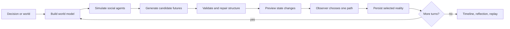

<p align="center">
  
</p>

<h1 align="left">xMocha</h1>

xMocha is a multi-universe decision agent system for exploring choices as branching futures.

xMocha helps people explore choices as branching futures. Give it a real decision or a fictional world, compare several possible paths, choose one, and continue from that new present. The goal is not to predict the future or give one final answer. The goal is to make possible consequences easier to inspect, compare, replay, and discuss.

<p align="center">
  <a href="https://xmocha.ai">Website</a>
  ·
  <a href="#quick-start">Quick start</a>
  ·
  <a href="CONTRIBUTING.md">Contributing</a>
  ·
  <a href="LICENSE">Apache-2.0</a>
</p>

## Two Mode

xMocha is a multi-universe decision agent with two modes:


| Mode          | Entry    | What it does                                                                                                                        |
| ------------- | -------- | ----------------------------------------------------------------------------------------------------------------------------------- |
| Decision Mode | `/`      | Simulates real-life choices through branching futures, stakeholders, world changes, shadow paths, and a final reflection.           |
| World Mode    | `/world` | Experimental mode that compiles short lore/story text into a playable world with characters, rules, events, and role-based choices. |


The core idea is simple:

- the **world agents** is the environment: context, constraints, time, events, and state;
- **social agents** represent people, communities, institutions, or society reacting around the user;
- the **user** is the observer and decision-maker: the single agent who chooses which future becomes the next present.

Decision Mode is the main product wedge. World Mode is experimental and developer-facing, but it shows the broader direction: xMocha can become a general runtime for worlds, agents, and branching timelines.

## Quick Start

Start with a real model-backed run if you want to experience xMocha's actual generation behavior.

```bash
git clone https://github.com/OKitchen/xMocha.git
cd xMocha
npm ci
cp .env.example .env.local
```

Add at least one provider key to `.env.local`. For example:

```env
XMOCHA_MODEL_PROVIDER=google
GOOGLE_API_KEY=your_google_ai_studio_key
```

Then start the app:

```bash
npm run web:dev
```

Then open:

```text
http://localhost:3000
```

In `Model settings`, choose the provider/model you configured and click `Test selected model` before starting a Decision Mode or World Mode session.

For a no-cost local UI run without Google, Neon, Hugging Face, Ollama, or any API key, use mock mode:

```bash
npm run web:mock
```

Run checks:

```bash
npm test
npm run web:build
npm run eval:mock
npm run eval:world
```


## How The Simulation Works




The core product rule is simple:

```text
Only the selected branch becomes canonical state.
Unselected futures become shadow timelines.
The user remains the observer and decision-maker.
Model failure should never erase the user's choice.
```


## Current Features

- Next.js app with Decision Mode and experimental World Mode.
- Google GenAI/Gemma, Hugging Face, OpenAI, Anthropic, DeepSeek, local Gemma/Ollama, and mock/fallback provider paths.
- Deterministic fallback so a journey can complete even when a model times out.
- Branch-first UX: users choose generated futures or write custom actions.
- Immediate branch persistence before next-turn generation.
- File-backed local persistence by default
- Safety and privacy notices for user-entered dilemmas.
- Share links, report download, and result replay.
- WorldPack compiler for short text/lore inputs with quality gates.


## Optional Model And Database Setup

Copy the environment template:

```bash
cp .env.example .env.local
```

For hosted or production-style use, configure a server default plus any provider
keys you want to test. `XMOCHA_MODEL_PROVIDER` is only the default when the
browser selector is set to `Server default`; it does not lock the backend to one
provider.

```env
XMOCHA_MODEL_PROVIDER=google
GOOGLE_API_KEY=
GOOGLE_GENAI_MODEL=
GOOGLE_MAX_OUTPUT_TOKENS=4000
HF_TOKEN=
OPENAI_API_KEY=
DEEPSEEK_API_KEY=
ANTHROPIC_API_KEY=
GEMMA_RUNTIME=ollama
GEMMA_MODEL=gemma4
OLLAMA_BASE_URL=http://localhost:11434
XMOCHA_GENERATION_TIMEOUT_MS=50000

# Local default: omit both values to store data under .xmocha-data/.
# Production/serverless:
# XMOCHA_SESSION_STORAGE=postgres
# DATABASE_URL=
XMOCHA_RATE_LIMIT_SALT=
```
### Storage

Local sessions, private WorldPacks, turn traces, contacts, and rate-limit state
are written to `.xmocha-data/` when `DATABASE_URL` is unset or
`XMOCHA_SESSION_STORAGE=file` is set. Use Postgres/Neon for durable hosted
deployments, and apply migrations before starting a Postgres-backed app:

```bash
npm run db:migrate
```

Start one local web backend:

```bash
npm run web:dev
```

Then open:

```text
http://localhost:3000
```

In `Model settings`, choose Hugging Face, OpenAI, Google GenAI, Gemma / Ollama,
DeepSeek, or Anthropic for that run. Click `Test selected model` before starting
a session to confirm the selected provider can actually answer.

Provider-specific web scripts still exist, but they only set the initial server
default:

```bash
npm run web:hf
npm run web:google
npm run web:openai
npm run web:gemma
```

They are not required for switching providers in the browser.

### Real Model Local Run

1. Put provider tokens in `.env.local`. Empty keys are fine for providers you do not plan to test.
2. Start one backend:

```bash
npm run web:dev
```

1. Open `http://localhost:3000`.
2. Open `Model settings`, choose provider/model, and click `Test selected model`.
3. Run Decision Mode or World Mode. The session `Engine` tab shows selected provider/model, actual provider/model, and any fallback reason.

The browser never asks for API keys. Keep provider tokens in server-side `.env.local`.

### Switching From Mock To Real Models

If you were running `npm run web:mock` and then start `npm run web:dev`, you may see:

```text
Port 3000 is in use by process 59675, using available port 3001 instead.
Another next dev server is already running.
Run kill 59675 to stop it.
```

This means an older Next dev server for this same project is still running. It is often the previous mock server, so `http://localhost:3000` will keep using mock/fallback behavior even if you select a real provider in the UI.

Fix: stop the old server first. If its terminal is still open, press `Ctrl+C` there. If it is detached or you cannot find that terminal, check who owns port 3000:

```bash
lsof -nP -iTCP:3000 -sTCP:LISTEN
```

Then kill the PID printed by Next or `lsof`:

```bash
kill 59675
```

Replace `59675` with the PID printed by Next. If the same PID is still listening after `kill`, force-stop the stale dev process:

```bash
kill -9 59675
```

Confirm port 3000 is free:

```bash
lsof -nP -iTCP:3000 -sTCP:LISTEN
```

If that command prints no listening process, start the real-model backend again:

```bash
npm run web:dev
```

After restart, open the exact URL printed by the server. Prefer getting the real-model backend back on `http://localhost:3000`; if Next prints `http://localhost:3001`, use `3001` in the browser and remember that `3000` may still be the old server.

If the old PID is gone but Next still reports a running dev server, the generated dev lock may be stale. Confirm no Next server is running for this project, then remove the generated lock and start again:

```bash
rm -f .next/dev/lock
npm run web:dev
```

To confirm whether a run used the selected provider or fallback, open the session trace in the app. A real provider run should show the selected provider and model. If it shows `deterministic-fallback` / `model: none`, the backend did not use the selected model for that turn.

## Contributing

Good early contribution areas:

- documentation cleanup and examples
- additional WorldPack samples using original or public-domain material
- UI polish for Decision Mode and World Mode
- regression/evaluation cases
- dynamic scoring and path-metric research
- privacy-safe training/eval data proposals
- provider adapters and model comparison notes
- analytics queries and lightweight dashboard ideas
- accessibility and mobile usability improvements
- better report/replay/share surfaces

Please read `CONTRIBUTING.md` before opening a PR. For simulation quality, scoring, path metrics, or training-method work, also read `docs/evaluation-and-training.md`. Do not submit copyrighted fictional worlds, private user data, raw prompt logs, or secrets.

## Safety And Privacy

xMocha is for reflection and scenario simulation. It does not provide medical, legal, financial, or mental-health advice.

Users should not enter ID documents, passwords, complete financial records, complete health records, or other highly sensitive information.

Private uploaded World source text is not intended to be persisted as raw source. Production sessions and analytics should be treated as sensitive product data.

## Status

xMocha is an early MVP. The current wedge is Decision Mode: practical decision simulation for people facing career, startup, and life choices. World Mode demonstrates the broader simulation runtime for fictional or structured agent worlds.

Current focus:

- modularize xMocha so the world model, social agents, scoring, UI surfaces, and persistence can evolve independently;
- make the simulation more flexible, interesting, and realistic without making the core runtime hard to maintain;
- deepen selected domain use cases where branching simulation can be genuinely helpful, starting with career, startup, and AI-transition decisions;
- improve evaluation cases, dynamic scoring, path metrics, safety boundaries, and replay/share artifacts;


## License

Apache-2.0. See `LICENSE`.
